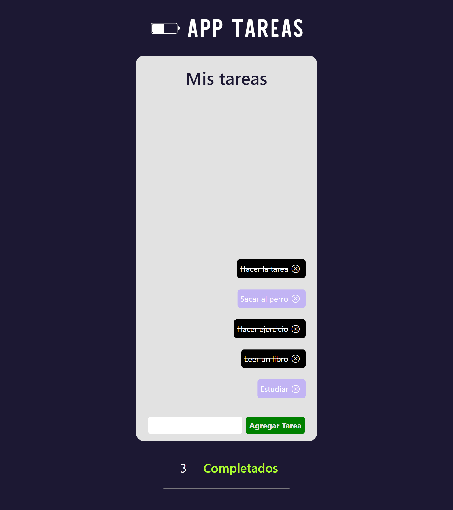

# App Web de Tareas con Forma de Celular

Esta es una aplicación web de tareas con una interfaz que simula la apariencia de un celular. Fue desarrollada utilizando Create React App, React, CSS y HTML como parte de una prueba para comprobar conocimientos en React.

## Características

- Interfaz de usuario con apariencia de celular, proporcionando una experiencia de uso familiar y amigable.
- Funcionalidades básicas de una lista de tareas, como agregar, eliminar y marcar como completadas las tareas.
- Persistencia de datos utilizando el almacenamiento local del navegador.
- Diseño responsive, compatible con diferentes dispositivos y tamaños de pantalla.

## Capturas de pantalla

## Tecnologías utilizadas

- React
- CSS
- HTML

## Instalación

1. Clona este repositorio: `git clone https://github.com/JeremyTierra/AppTareas.git`
2. Navega al directorio del proyecto: `cd AppTareas`
3. Instala las dependencias: `npm install`
4. Inicia la aplicación: `npm start`
5. Abre tu navegador y ve a `http://localhost:3000`
